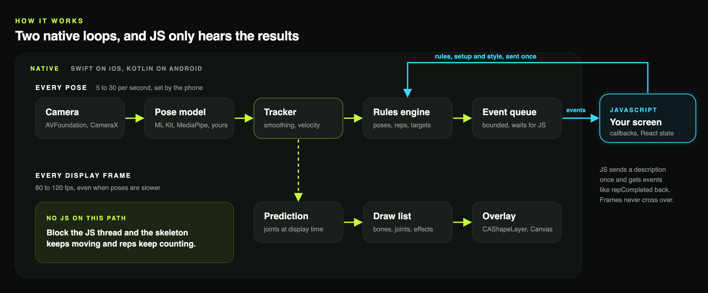
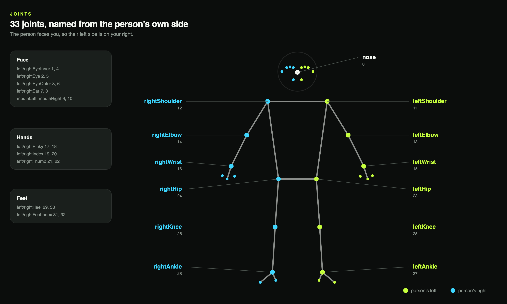
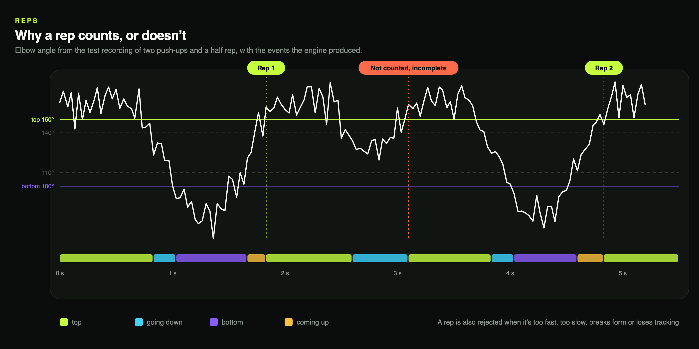
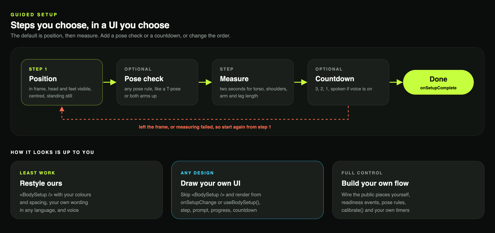
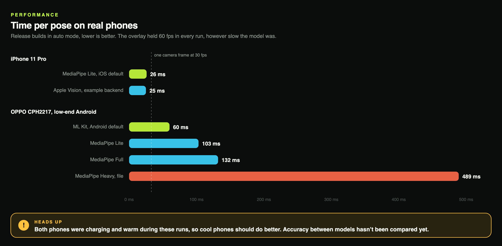
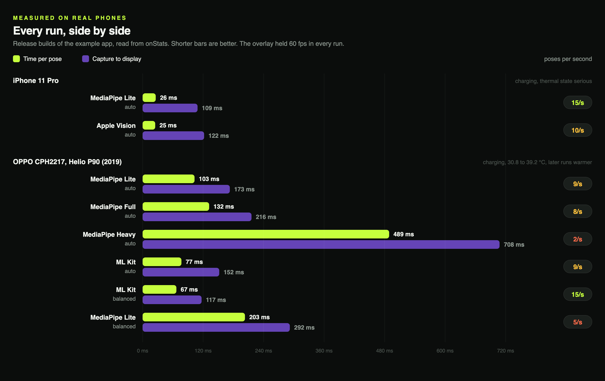

# expo-body-vision

<p align="center">
  
</p>

<p align="center">
  <a href="https://drive.google.com/file/d/1GeauqR8CniEURJ31pNrtW5lPRuGbFpOm/view?usp=sharing">Full-size video</a> · <a href="#benchmarks">Benchmarks on real phones</a>
  <br />
  <sub>The GIF and the video play at 1.3x speed to keep them short.</sub>
</p>

Body tracking for React Native and Expo, fully native on iOS and Android. The camera, the pose
model, tracking, your rules and the skeleton all run in Swift and Kotlin. JavaScript describes
what to watch for once, then only hears about the moments that matter, like
`{ type: 'repCompleted', exercise: 'pushup', count: 12 }`. Camera frames never touch JS, so you
can block the JS thread for four seconds and the skeleton keeps following the user and reps keep
counting. [How it works](#how-it-works) shows the full path.

Use it to count push-ups, squats and punches, react when someone holds a T-pose or raises both
hands, build games where players hit targets with their hands, walk users into frame before a
workout, or count reps in a video they recorded earlier. [Examples](#examples) has a short recipe
for each.

Almost every part can be swapped or extended:

- **Pose model.** Android ships ML Kit (default) and MediaPipe Lite and Full. iOS ships MediaPipe
  Lite (default) and Full. Load your own MediaPipe `.task` file on either, or register your own
  detector in Swift or Kotlin. The example app adds Apple Vision this way. See
  [Backends and models](#backends-and-models), [Your own model file](#your-own-model-file) and
  [Your own native backend](#your-own-native-backend).
- **Rules.** Poses, exercises and hand targets are plain data you write in TypeScript, from angles,
  distances and heights between joints. The engine runs them natively. See
  [Pose triggers](#pose-triggers), [Exercises](#exercises) and [Targets](#targets).
- **Steps in order.** Chain steps into a sequence: get in position, hold a T-pose, then raise
  both hands, measure, count down. Each pose step is checked natively and only moves on when its
  own pose holds. `onSetupChange` tells you the current step, and your rules can wait until the
  sequence is done. See [Unlock the fight after a setup](#unlock-the-fight-after-a-setup) for a
  full example and [Steps](#steps) for every step type.
- **Voice guidance.** Setup prompts can be spoken out loud, so users don't have to read the screen
  from across the room. `voice: true` uses expo-speech, with your own language, rate and voice,
  or pass `speak` to use any text-to-speech you like. Prompts are left and right from the user's
  side, and every line can be reworded. See [Prompts and voice](#prompts-and-voice).
- **UI.** Anything you put inside the view renders over the camera: your own setup screen, HUD,
  buttons or animations. The skeleton is styled per bone and joint, with trails. See
  [Your own look](#your-own-look) and [Styling the skeleton](#styling-the-skeleton).
- **Effects and setup are optional add-ons.** `/effects` brings hit, rep, combo and aura effects
  drawn with Skia, plus your own shaders. `/setup` brings a ready-made guided setup. The main
  package doesn't pull in Skia or Reanimated unless you import them. See [Effects](#effects),
  [Your own effect](#your-own-effect) and [Guided setup](#guided-setup).
- **Inputs.** Live front or back camera with a flash toggle, a video file, or recorded body frames
  for tests. See [Camera switch and flash](#camera-switch-and-flash),
  [Analyzing a video file](#analyzing-a-video-file) and
  [Testing without a camera](#testing-without-a-camera).

It's built for phones that aren't new. On an OPPO CPH2217 (MediaTek Helio P90, 2019) the model
runs 5 to 15 times a second depending on the backend, and the overlay still draws at 60 fps because
joints are predicted forward to the display between poses. On an iPhone 11 Pro a pose takes about
20 to 26 ms. See [Performance](#performance) for how it adapts and the numbers.

## At a glance

- **Fully native**: camera, model, tracking, rules and drawing run in Swift and Kotlin, and keep
  going while the JS thread is blocked
- **Live skeleton** over the camera, drawn natively with per-bone styling and motion trails
- **Rep counting** for push-ups, squats and punches, plus your own exercises on the same
  state machine that rejects half reps, too-fast reps and bad form
- **Pose triggers** written in TypeScript (angles, inclinations, distances) with hold times and
  hysteresis
- **Body interaction** for games, with hand or any-joint targets, native hit testing and a hit
  effect that doesn't wait for JS
- **Guided setup** that talks the user into frame, can ask for a confirming pose, measures their
  proportions and counts down, with a built-in or fully custom UI
- **Steps in order**: chain position, any number of poses, measuring and a countdown, each pose
  holding before the next, and hold your rules until the sequence is done
- **Voice guidance** that reads the prompts out through expo-speech in any language, or through
  your own text-to-speech
- **Adaptive performance** that lowers the inference rate when a phone can't keep up or gets hot,
  while the overlay stays at display rate
- **Video files** run through the same engine without a camera, so you can count reps in a
  recorded workout, compare models on identical frames, or play the clip with the overlay
- **Effects** for hits, reps, combos, held poses and setup: anime, lightning, fire, pixel,
  shatter and JoJo hits, rep slams, level ups, combo fever, an aura and confetti, all
  configurable, or your own shader through `createImpactEffect`
- **Portrait and landscape**, front and back camera, mirroring handled for you
- **Camera switch and flash** as ready-made `<CameraControls />` buttons, or a hook for your own
- **Live numbers** for your UI: `useRepStats` keeps count, sides, combos and misses, and
  `useBodyVisionStats` reports fps, time per pose and latency for a debug badge
- **Swappable pose backends**. ML Kit and MediaPipe are built in, and you can load your own
  `.task` model file or register your own Swift or Kotlin detector
- **Optional add-ons**: `/effects` and `/setup` bring Skia and Reanimated only if you import them
- **Testable without a camera**, since recorded body sequences can stand in for the camera in
  unit and end-to-end tests

## Tech stack

| Layer | iOS | Android |
| --- | --- | --- |
| Module and bridge | Expo Modules API, Swift | Expo Modules API, Kotlin |
| Camera | AVFoundation, BGRA buffers rotated upright on the connection | CameraX 1.6.2, SurfaceView preview, RGBA analysis frames |
| Pose model (default) | MediaPipe Pose Landmarker 1.0.0, lite and full models bundled | ML Kit Pose 18.0.0-beta5, bundled model |
| Pose model (also built in) | None. Add your own through `BodyVisionBackends`, like the example's Apple Vision backend | MediaPipe Pose Landmarker 1.0.0 |
| Video files | AVAssetReader for analysis, AVPlayer for the live preview | MediaMetadataRetriever for analysis, MediaPlayer on a TextureView for the live preview |
| Body engine | Swift, Foundation only: One Euro smoothing, prediction, rules, exercises, hit testing, readiness, calibration | The same engine in Kotlin, plain JVM |
| Overlay | CAShapeLayer, driven by CADisplayLink | Hardware-accelerated Canvas view, driven by Choreographer |
| Minimum OS | iOS 15.1 | As set by Expo |

| Area | Choice |
| --- | --- |
| Public API | TypeScript, React components and plain rule definitions |
| Setup overlay and effects (optional) | React Native Skia and Reanimated, only in the `/setup` and `/effects` entries |
| Voice (optional) | expo-speech, loaded only when `voice` is on |
| Custom model files (optional) | expo-asset, loaded only when `model` is a bundled file |
| Tests | Jest, XCTest on macOS, JUnit on the JVM, Maestro for end-to-end |
| Example app | Expo SDK 55, React Native 0.83 |

The two engines are written separately in Swift and Kotlin and replay the same recorded
sequences in their test suites, which must produce byte-identical event traces. Skia,
Reanimated and expo-speech are optional peers that the main entry never imports.

## Install

```bash
npx expo install @rbayuokt/expo-body-vision@latest
npx expo prebuild
```

```json
{
  "expo": {
    "plugins": [["@rbayuokt/expo-body-vision", { "cameraPermission": "Used to count your reps." }]]
  }
}
```

The config plugin sets `NSCameraUsageDescription` on iOS and declares `CAMERA` on Android. It
needs a development build, since Expo Go doesn't ship the native module. In a bare React Native
app, run `npx install-expo-modules@latest` first.

The guided setup overlay, the effects and spoken prompts use optional peers. Install them only if
you use them.

```bash
npx expo install @shopify/react-native-skia react-native-reanimated  # <BodySetup /> and /effects
npx expo install expo-speech                                          # voice prompts
```

## No time to read the docs?

Let your coding agent read them for you. [llms-full.txt](llms-full.txt) holds the whole API, the
recipes and the shader contract for custom effects in one file written for Claude, Codex, Cursor
and the like. It ships inside the package, so after installing it's already on disk.

Point the agent at the file and describe what you want.

```text
Read node_modules/@rbayuokt/expo-body-vision/llms-full.txt, then build a squat
counter screen with the front camera. Show the count big, say GOOD! on a full
rep and HALF REP when it's not counted.
```

```text
Using llms-full.txt from @rbayuokt/expo-body-vision, make a boxing screen that
counts jabs and crosses separately, uses the lightning impact effect, shakes the
screen on every hit and drops to the minimal effect level on slow phones.
```

```text
Using llms-full.txt from @rbayuokt/expo-body-vision, give my boxing screen the
JoJo's Bizarre Adventure look (ImpactEffect look="jojo") and show ORA ORA ORA
through ComboFever once a combo starts. Then write a createImpactEffect variant
of it in red and black with ゴゴゴ words for my rival's side. Keep it inside the
radius so it still looks right at the balanced level, and check the shader
compiles with canvaskit-wasm first.
```

Agents that can't read local files can use the copy on GitHub,
`https://raw.githubusercontent.com/rbayuokt/expo-body-vision/main/llms-full.txt`.

## Documentation


- [Your first screen](#your-first-screen)
- [Examples](#examples)
  - [Count reps after a quick setup](#count-reps-after-a-quick-setup)
  - [Trigger something when a pose is held](#trigger-something-when-a-pose-is-held)
  - [Hit targets with your hands](#hit-targets-with-your-hands)
  - [Boxing with hit effects](#boxing-with-hit-effects)
  - [Unlock the fight after a setup](#unlock-the-fight-after-a-setup)
  - [Guided setup with the built-in overlay](#guided-setup-with-the-built-in-overlay)
  - [Restyle the skeleton](#restyle-the-skeleton)
  - [Count reps in a recorded video](#count-reps-in-a-recorded-video)
  - [Show live fps on screen](#show-live-fps-on-screen)
- [Camera switch and flash](#camera-switch-and-flash)
- [How it works](#how-it-works)
- [Poses, exercises and targets](#poses-exercises-and-targets)
  - [Pose triggers](#pose-triggers)
  - [Exercises](#exercises)
  - [Targets](#targets)
- [Listening to events](#listening-to-events)
  - [Live performance numbers](#live-performance-numbers)
  - [Counting stats](#counting-stats)
- [Guided setup](#guided-setup)
  - [Steps](#steps)
  - [Your own look](#your-own-look)
  - [Tuning and reusing calibration](#tuning-and-reusing-calibration)
  - [Prompts and voice](#prompts-and-voice)
- [Styling the skeleton](#styling-the-skeleton)
- [Effects](#effects)
  - [Tuning them](#tuning-them)
  - [Your own effect](#your-own-effect)
- [Analyzing a video file](#analyzing-a-video-file)
  - [Watching it with the overlay](#watching-it-with-the-overlay)
- [Performance](#performance)
  - [Benchmarks](#benchmarks)
  - [Measured on real phones](#measured-on-real-phones)
- [Backends and models](#backends-and-models)
  - [Your own model file](#your-own-model-file)
  - [Your own native backend](#your-own-native-backend)
- [Testing without a camera](#testing-without-a-camera)
- [Platform notes](#platform-notes)
- [Example app](#example-app)
- [Architecture](#architecture)
- [Scripts](#scripts)

## Your first screen

A complete screen that counts push-ups. It asks for the camera, then shows the count over the
live preview.

```tsx
import { BodyVisionView, pushUp, useCameraPermissions } from '@rbayuokt/expo-body-vision';
import { useState } from 'react';
import { Button, Text } from 'react-native';

const RULES = [pushUp()];

export function PushUps() {
  const [permission, requestPermission] = useCameraPermissions();
  const [count, setCount] = useState(0);

  if (!permission?.granted) return <Button title="Allow camera" onPress={requestPermission} />;
  return (
    <BodyVisionView style={{ flex: 1 }} rules={RULES} onRep={(e) => setCount(e.count)}>
      <Text style={{ color: 'white', fontSize: 64 }}>{count}</Text>
    </BodyVisionView>
  );
}
```

Outside React, `getCameraPermissionsAsync()` and `requestCameraPermissionsAsync()` do the same
as the hook. `resizeMode` is `cover` (default, fills the view and crops) or `contain` (the whole
camera image, letterboxed), and the overlay follows either way.

The native skeleton is on by default. Children render over the preview. Rules are sent to
native once and re-sent only when their serialized value changes, so inline arrays and
objects don't cost anything per render.

## Examples

One recipe per screen in the example app, smallest version first. Each assumes camera permission
is already granted, like in [Your first screen](#your-first-screen), and links to the full screen.

These are starting points, not the only way to use the library. Mix them, change the rules, draw
your own UI, or build something none of them cover, like a dance game, a yoga hold timer or a
physio exercise tracker. The pieces are the same: rules describe what to watch for, events tell
you when it happened, and what you show is up to you.

### Count reps after a quick setup

The user gets into position first, and push-ups only start counting once setup is done.
`useRepStats` keeps the numbers.

```tsx
import { BodyVisionView, pushUp, useRepStats } from '@rbayuokt/expo-body-vision';
import { BodySetup } from '@rbayuokt/expo-body-vision/setup';
import { Text } from 'react-native';

const RULES = [pushUp()];

export function PushUps() {
  const { stats, track } = useRepStats();
  return (
    <BodyVisionView
      style={{ flex: 1 }}
      rules={RULES}
      setup={{ framing: 'floor', startRules: 'afterSetup' }}
      {...track}>
      <BodySetup />
      <Text style={{ color: 'white', fontSize: 64 }}>{stats.count}</Text>
      <Text style={{ color: 'white' }}>Not counted: {stats.missed}</Text>
    </BodyVisionView>
  );
}
```

Swap `pushUp()` for `squat()` and `framing: 'floor'` for `'fullBody'` to count squats.
Full screen: [example/screens/ExerciseScreen.tsx](example/screens/ExerciseScreen.tsx).

### Trigger something when a pose is held

`onPoseEntered` fires once when the pose has held long enough, `onPoseExited` when it ends.

```tsx
import { BodyVisionView, tPose } from '@rbayuokt/expo-body-vision';
import { useState } from 'react';
import { Text } from 'react-native';

const RULES = [tPose()];

export function TPose() {
  const [holding, setHolding] = useState(false);
  return (
    <BodyVisionView
      style={{ flex: 1 }}
      rules={RULES}
      onPoseEntered={() => setHolding(true)}
      onPoseExited={(e) => {
        setHolding(false);
        console.log(`held for ${e.durationMs} ms`);
      }}>
      <Text style={{ color: 'white', fontSize: 32 }}>{holding ? 'Holding!' : 'Arms out'}</Text>
    </BodyVisionView>
  );
}
```

`armsUp()` works the same way for both hands up. Write your own with
[Pose triggers](#pose-triggers). Full screen:
[example/screens/TPoseScreen.tsx](example/screens/TPoseScreen.tsx).

### Hit targets with your hands

A target is a spot on screen, in fractions of the view. Native checks the wrists against it on
every pose and plays a hit pulse without waiting for JS.

```tsx
import { BodyVisionView, defineTarget } from '@rbayuokt/expo-body-vision';
import { useState } from 'react';

const SPOTS = [
  [0.2, 0.3],
  [0.8, 0.3],
  [0.5, 0.2],
];

export function TargetGame() {
  const [i, setI] = useState(0);
  const [x, y] = SPOTS[i];
  return (
    <BodyVisionView
      style={{ flex: 1 }}
      rules={[defineTarget({ id: 'pad', x, y, radius: 0.08 })]}
      onTargetHit={() => setI((n) => (n + 1) % SPOTS.length)}
    />
  );
}
```

Full screen: [example/screens/TargetScreen.tsx](example/screens/TargetScreen.tsx).

### Boxing with hit effects

`punch()` counts each punch and says which hand threw it. The effects come from the optional
`/effects` entry (needs Skia and Reanimated).

```tsx
import { BodyVisionView, punch, useRepStats } from '@rbayuokt/expo-body-vision';
import { ComboFever, ImpactEffect, useImpactShake } from '@rbayuokt/expo-body-vision/effects';
import { Text } from 'react-native';
import Animated from 'react-native-reanimated';

const RULES = [punch()];

export function Boxing() {
  const { stats, track } = useRepStats();
  const shake = useImpactShake();
  return (
    <Animated.View style={[{ flex: 1 }, shake.style]}>
      <BodyVisionView style={{ flex: 1 }} rules={RULES} smoothing="none" {...track}>
        <ImpactEffect look="anime" onImpact={shake.shake} />
        <ComboFever from={5} />
        <Text style={{ color: 'white' }}>
          Left {stats.left} · Right {stats.right} · Best combo x{stats.best}
        </Text>
      </BodyVisionView>
    </Animated.View>
  );
}
```

Other looks: `lightning`, `fire`, `pixel`, `shatter` and `jojo`. Full screen:
[example/screens/BoxingScreen.tsx](example/screens/BoxingScreen.tsx).

### Unlock the fight after a setup

Position, a T-pose to confirm, a measurement and a countdown, then punches start counting.
`onSetupChange` hands you the step and the prompt text, so the UI is yours.

```tsx
import { BodyVisionView, punch, tPose, type SetupStep } from '@rbayuokt/expo-body-vision';
import { useState } from 'react';
import { Text } from 'react-native';

const STEPS: SetupStep[] = [
  'position',
  { pose: tPose(), prompt: 'Arms out wide to confirm' },
  'calibrate',
  { countdown: 3 },
];
const RULES = [punch()];

export function BoxingSetup() {
  const [prompt, setPrompt] = useState('');
  const [unlocked, setUnlocked] = useState(false);
  return (
    <BodyVisionView
      style={{ flex: 1 }}
      rules={RULES}
      setup={{ steps: STEPS, startRules: 'afterSetup' }}
      onSetupChange={(state, text) => setPrompt(text)}
      onSetupComplete={() => setUnlocked(true)}>
      <Text style={{ color: 'white', fontSize: 28 }}>{unlocked ? 'FIGHT!' : prompt}</Text>
    </BodyVisionView>
  );
}
```

Call `restartSetup()` on the view's ref to run it again. Full screen:
[example/screens/BoxingSetupScreen.tsx](example/screens/BoxingSetupScreen.tsx).

### Guided setup with the built-in overlay

Turn `setup` on and drop in `<BodySetup />` for a stand-here silhouette, prompts, arrows and a
progress bar. `voice: true` reads the prompts out through expo-speech.

```tsx
import { BodyVisionView } from '@rbayuokt/expo-body-vision';
import { BodySetup } from '@rbayuokt/expo-body-vision/setup';

<BodyVisionView
  style={{ flex: 1 }}
  setup={{ framing: 'fullBody', voice: true }}
  onSetupComplete={(calibration) => console.log(calibration?.torsoLength)}>
  <BodySetup accentColor="#C6FF3D" />
</BodyVisionView>;
```

Full screen: [example/screens/SetupScreen.tsx](example/screens/SetupScreen.tsx). For your own
look instead of `<BodySetup />`, see
[example/screens/CustomSetupScreen.tsx](example/screens/CustomSetupScreen.tsx) and
[Your own look](#your-own-look).

### Restyle the skeleton

```tsx
<BodyVisionView
  style={{ flex: 1 }}
  skeleton={{
    boneColor: '#FFFFFF',
    jointColor: '#30D158',
    bones: { leftForearm: { color: '#FF6B4A' }, rightForearm: { color: '#3DD6FF' } },
    trails: [{ joint: 'rightWrist', color: '#3DD6FF', lengthMs: 450 }],
  }}
/>
```

Full screen: [example/screens/SkeletonScreen.tsx](example/screens/SkeletonScreen.tsx).

### Count reps in a recorded video

No camera needed. The file runs through the same engine and you get the events back.

```ts
import { analyzeVideo, pushUp } from '@rbayuokt/expo-body-vision';

const result = await analyzeVideo(videoUri, { rules: [pushUp()] });
const reps = result.events.filter((e) => e.type === 'repCompleted').length;
```

To watch it with the skeleton instead, pass the file as `video` to the view. Full screen:
[example/screens/VideoScreen.tsx](example/screens/VideoScreen.tsx).

### Show live fps on screen

`useBodyVisionStats` works in any child of the view and switches native stats on while mounted.

```tsx
import { BodyVisionView, useBodyVisionStats } from '@rbayuokt/expo-body-vision';
import { Text } from 'react-native';

function Fps() {
  const stats = useBodyVisionStats();
  if (!stats) return null;
  return (
    <Text style={{ color: 'white' }}>
      {Math.round(stats.renderFps)} fps · {Math.round(stats.inferenceMs)} ms per pose
    </Text>
  );
}

<BodyVisionView style={{ flex: 1 }}>
  <Fps />
</BodyVisionView>;
```

The draggable badge in the example is
[example/components/FloatingStats.tsx](example/components/FloatingStats.tsx).

## Camera switch and flash

Drop `<CameraControls />` inside the view for a flip button and a flash button. The flash
button only shows on a camera that has a torch (on phones that's usually the back one), and
nothing shows while a video or test input replaces the camera.

```tsx
<BodyVisionView style={{ flex: 1 }} rules={RULES}>
  <CameraControls style={{ top: 100 }} />
</BodyVisionView>
```

Change the look with `buttonStyle`, `color`, `activeColor`, `activeIconColor`, your own
`icons={{ flip, torchOn, torchOff }}` and `labels` for accessibility. For your own buttons,
`useCameraControls()` gives `{ facing, flip, torch, setTorch, hasTorch, available }`.

`flip()` switches away from whatever `facing` says and turns the torch off. To drive the torch
yourself, pass `torch` to the view. `onCameraReady` reports `hasTorch` for each camera start.

## How it works

<p align="center">
  
</p>

Each `BodyVisionView` runs two native loops. The top one handles every pose the model returns,
from the camera through the tracker and your rules to a queue of events for JS. The bottom one
runs on every display frame and draws the overlay from where the joints are predicted to be at
that moment.

Camera, inference and drawing run at their own rates. On a slow phone the model might manage
7 poses a second while the overlay still draws at 60 fps, extrapolating joints to display
time. Prediction is capped (100 ms by default) and fades with joint confidence, so a lost or
wrong joint can't fling the skeleton across the screen.

Events reach JS in batches, one batch in flight at a time. JS acknowledges each batch after
running your callbacks. If JS falls behind, state events (reps, poses, hits) wait in a
bounded buffer and telemetry like `onStats` keeps only its latest value, so a blocked JS
thread never builds up an unbounded queue.

One body is tracked at a time. Joints use the 33-point BlazePose layout (`JOINTS`), and event
payloads carry a `bodyId` that changes when the body is lost and found again.

## Poses, exercises and targets

With the camera running, the next step is telling the engine what to look for.

<p align="center">
  
</p>

Rules refer to joints by these names, always from the person's own side.

Everything in `rules` is plain data built in JS and evaluated natively on every pose.

### Pose triggers

```ts
import { angle, definePose, inclination } from '@rbayuokt/expo-body-vision';

const armsWide = definePose({
  id: 'arms-wide',
  holdMs: 500,
  when: [
    inclination('leftShoulder', 'leftWrist').atMost(20),
    inclination('rightShoulder', 'rightWrist').atMost(20),
    angle('leftShoulder', 'leftElbow', 'leftWrist').atLeast(150),
    angle('rightShoulder', 'rightElbow', 'rightWrist').atLeast(150),
  ],
});
```

`onPoseEntered` fires once the conditions have held for `holdMs`, `onPoseExited` once they
fail for `exitGraceMs`. These are the measurements you can use.

| Measure | Value |
| --- | --- |
| `angle(a, b, c)` | Interior angle at `b`, 0 to 180 degrees |
| `inclination(a, b)` | Segment angle from horizontal, 0 to 90 degrees |
| `distance(a, b)` | In torso lengths (or the calibrated torso length) |
| `above(a, b)` | How far `a` is above `b`, in torso lengths |

Add `.mirrored()` to also measure the left/right-swapped joints and use whichever side is
tracked better, which is what side-on exercises need. Ranges widen slightly while a rule is
active (`hysteresis`), so a pose doesn't flicker at the edge. Invalid rules throw a
`BodyVisionError` with a path like `pose.conditions[0].joints[2]`, in JS before anything
reaches native, and native checks them again.

`tPose()` and `armsUp()` are ready-made.

### Exercises

<p align="center">
  
</p>

`pushUp()` and `squat()` are presets of one state machine, where `top → descending → bottom →
ascending → top` counts a rep. You can build your own the same way.

```ts
import { angle, defineExercise, inclination } from '@rbayuokt/expo-body-vision';

const curl = defineExercise({
  id: 'curl',
  metric: angle('leftShoulder', 'leftElbow', 'leftWrist').mirrored(),
  top: 150,
  bottom: 60,
  minRepMs: 600,
  requires: [inclination('leftShoulder', 'leftHip').mirrored().atLeast(60)],
});
```

The metric is large at the top and small at the bottom. Thresholds use hysteresis, brief
tracking loss holds the current phase for `lossGraceMs`, and a rep that turns back early,
goes too fast, too slow or breaks a `requires` condition arrives as `onRepRejected` with a
reason (`incomplete`, `too-fast`, `too-slow`, `form`, `lost`) instead of counting.
`ref.resetExercise()` zeroes counts.

Some movements are too quick for a full cycle to show up at 30 fps. A punch can be three frames
long. For those, `mode: 'peak'` counts each sharp rise instead. A rep is a rise of at least
`top - bottom` that reaches `top`, and the counter re-arms after an equal drop. A mirrored
metric then watches both sides at once, peaks closer than `minRepMs` count once, and
`onRep` says which `side` it was.

```tsx
import { punch } from '@rbayuokt/expo-body-vision';

<BodyVisionView
  rules={[punch()]}
  smoothing="none"
  onRep={(e) => console.log(e.side === 'left' ? 'jab' : 'cross', e.count)}
/>
```

`punch()` is that preset on the elbow angle. Smoothing blunts short spikes, so turn it down for
fast strikes. On a 30 fps clip with a burst of ten punches in one second it still misses some,
because the motion blur hides the arm in those frames.

A peak rep also carries `joint` (the wrist for `punch()`) and `x`, `y`, where that joint was in
view points when it counted. [Effects](#effects) use that to land on the fist.

### Targets

```ts
import { defineTarget } from '@rbayuokt/expo-body-vision';

const pad = defineTarget({
  id: 'pad',
  x: 0.8,
  y: 0.3,
  radius: 0.07,
  colliders: ['leftWrist', 'rightWrist'],
  cooldownMs: 800,
  style: { hitColor: '#C6FF3D', particles: 16 },
});
```

Positions are fractions of the view, sizes fractions of its shorter side. Hit testing runs
natively on swept circles, so a fast hand that skips over a target between two poses still
hits it. The pulse and particle burst are drawn natively the moment it happens, then
`onTargetHit` reports the joint and its speed. `mode: 'zone'` gives `onZoneEntered` and
`onZoneExited` instead.

## Listening to events

Everything the engine notices comes back to JS as a callback on `BodyVisionView`.

| Callback | When |
| --- | --- |
| `onCameraReady` | First frame after (re)start, with size, backend and delegate |
| `onBodyDetected` / `onBodyLost` | A body appears, or is gone for `lostAfterMs` |
| `onPoseEntered` / `onPoseExited` | A pose rule starts or stops holding |
| `onExercisePhase` | Phase change in an exercise |
| `onRep` / `onRepRejected` | A rep counted, or discarded with a reason |
| `onTargetHit`, `onZoneEntered`, `onZoneExited` | Hand (or any collider) interactions |
| `onReadiness` | Readiness state changed (only when it settles) |
| `onSetupChange` / `onSetupComplete` | Guided setup progress and result |
| `onPerformanceChange` | `auto` changed the inference rate or effect level |
| `onStats` | About once a second |
| `onLandmarks` | Opt-in raw joints (`landmarks` prop), view coordinates, throttled natively |
| `onError` | A `BodyVisionError` with a stable `code` |

The error codes are `CAMERA_PERMISSION_DENIED`, `CAMERA_UNAVAILABLE`, `CAMERA_INTERRUPTED`,
`MODEL_LOAD_FAILED`, `INFERENCE_FAILED`, `GPU_UNAVAILABLE`, `INVALID_CONFIG`, `INVALID_RULE`,
`TEST_INPUT_DISABLED`, `VIDEO_READ_FAILED`, `CALIBRATION_FAILED`, `NOT_MOUNTED`, `UNSUPPORTED_PLATFORM`.

The ref has `calibrate({ durationMs })`, `resetExercise(id?)` and `restartSetup()`.

### Live performance numbers

`useBodyVisionStats()` returns the view's performance about once a second: `renderFps`,
`inferenceFps`, `inferenceMs`, `latencyMs`, `backend`, `delegate`, `thermalLevel` and more. Call it
in any child of the view and it switches native stats on while mounted, so a debug overlay needs
no `onStats` wiring. The example app shows a draggable FPS badge on every screen this way.

```tsx
function FpsBadge() {
  const stats = useBodyVisionStats();
  return <Text>{stats ? `${Math.round(stats.renderFps)} fps` : '-'}</Text>;
}

<BodyVisionView rules={[squat()]}>
  <FpsBadge />
</BodyVisionView>
```

### Counting stats

Most workout and game screens show the same numbers. `useRepStats` keeps them so you don't write
the combo timer yourself.

```tsx
import { BodyVisionView, punch, useRepStats } from '@rbayuokt/expo-body-vision';

const { stats, track, reset } = useRepStats({ comboGapMs: 900 });

<BodyVisionView rules={[punch()]} {...track} />
<Text>{stats.count} punches, {stats.left} jabs, combo x{stats.combo}, best x{stats.best}</Text>
```

`stats` has `count`, `left` and `right` (peak exercises), `combo` and `best`, `streak` (counted
reps since the last miss), `missed`, `lastMiss` and `lastRepAt`. `track` sets `onRep` and
`onRepRejected`. To react to reps yourself as well, call `track.onRep(e)` from your own handler.
`exercises` limits it to some exercise ids. `ComboFever` uses the same combo rule, so the fire
and your counter always agree.

## Guided setup

Most tracking problems come from framing, like feet out of view, standing too close or off to
one side. `setup` walks the user through it and measures them before you start counting.

<p align="center">
  
</p>

```tsx
import { BodySetup } from '@rbayuokt/expo-body-vision/setup';

<BodyVisionView
  style={{ flex: 1 }}
  setup={{ framing: 'fullBody', voice: true }}
  onSetupComplete={(calibration) => startWorkout(calibration)}>
  <BodySetup accentColor="#C6FF3D" topInset={insets.top + 60} bottomInset={panelHeight} />
</BodyVisionView>
```

Native readiness checks run in view space, so the preview's crop and mirroring count. They check
that the body is in frame with head and feet visible, at a good distance, centred, clearly visible
and standing still. Once the
user has been ready for `holdMs`, it calibrates for two seconds (torso length, shoulder width,
arm and leg length) and completes. Distance rules use the calibrated torso length afterwards.

Framings are `fullBody`, `upperBody` and `floor`. `floor` is for push-ups and planks. It wants
a side-on body lying horizontally and asks the user to turn the phone sideways when the view is
portrait.

### Steps

By default setup runs `['position', 'calibrate']`. `steps` replaces that with your own sequence.

```tsx
import { tPose } from '@rbayuokt/expo-body-vision';

<BodyVisionView
  setup={{
    steps: [
      'position',                                         // in frame, held for holdMs
      { pose: tPose(), prompt: 'Arms out wide to confirm' }, // any pose rule, checked natively
      'calibrate',                                        // measure proportions
      { countdown: 3 },                                   // 3, 2, 1
    ],
  }}
  onSetupComplete={startWorkout}
/>
```

A `pose` step takes any `definePose` rule, so a design can ask for whatever confirmation it
wants, like arms up, a wave or a squat hold. Its events stay inside setup and never reach your
`onPoseEntered`. Leaving the frame during a later step, or a failed calibration, starts over from
the first step.

### Your own look

The overlay is optional, and there are three ways to change how setup looks, from least to most
work.

**Restyle the built-in overlay.** Change the colours, the spacing and every line of text.

```tsx
<BodyVisionView
  setup={{
    framing: 'fullBody',
    voice: { language: 'id-ID' },
    prompts: { tooClose: 'Mundur sedikit', holdPosition: 'Tahan posisi', done: 'Siap!' },
  }}>
  <BodySetup accentColor="#FF6B4A" idleColor="rgba(255,255,255,0.5)" topInset={100} bottomInset={220} />
</BodyVisionView>
```

**Draw it yourself.** Leave `<BodySetup />` out and render from the state. Setup still runs
natively and speaks if `voice` is on, and nothing is drawn that you didn't draw.

```tsx
const [{ state: setupState, text }, setSetup] = useState({ state: null as SetupState | null, text: '' });

<BodyVisionView setup={{ steps }} onSetupChange={(state, text) => setSetup({ state, text })}>
  <MyStepper step={setupState?.step} count={setupState?.stepCount} />
  <MyPrompt text={text} />
  {setupState?.phase === 'calibrating' ? <MyListeningGlow /> : null}
  {setupState?.phase === 'countdown' ? <MyCountdown value={setupState.countdown} /> : null}
</BodyVisionView>
```

Children can also read the same state with `useBodySetup()`. The state carries `phase`
(`positioning`, `holding`, `posing`, `calibrating`, `countdown`, `done`), the `prompt` code and
any step `text`, `progress` from 0 to 1 for the current hold, measurement or countdown,
`screenDirection` for arrows, `step` and `stepCount`, `countdown`, and the `calibration` result.
`onSetupChange` also passes the prompt `text` to show, already resolved from the step's own
prompt, your `prompts` or the default. The example's Custom setup screen is built this way, with a
glowing edge while it measures and no library overlay at all.

**Count only after setup.** Give the view its rules up front and set `startRules: 'afterSetup'`.
They stay off while the user walks into frame and turn on when setup is done, with the measured
calibration already applied. `restartSetup()` pauses them again. No second view, no remount.

```tsx
<BodyVisionView
  setup={{ steps, startRules: 'afterSetup' }}
  rules={[punch()]}
  onSetupComplete={() => playUnlockAnimation()}
/>
```

The example's Boxing setup screen runs position, a T-pose, measuring and a countdown this way,
then unlocks the fight.

**Build your own flow.** Setup is made of public pieces, so you can wire them yourself with
`readiness` and `onReadiness` for the position checks, pose rules, `ref.calibrate()` and your own
timers.

### Tuning and reusing calibration

`setup.readiness` adjusts the position checks (`minBodyHeight`, `centerTolerance`,
`stillSpeed`), and `holdMs` and `calibrationMs` the timing.

Calibration belongs to one view. To measure once and use it on later screens, keep the result and
hand it back.

```tsx
// Setup screen
onSetupComplete={(calibration) => saveCalibration(calibration)}

// Any later screen: distance rules use the saved proportions, no second setup
<BodyVisionView calibration={savedCalibration} rules={[pushUp()]} />
```

### Prompts and voice

Prompts are codes with English defaults (`DEFAULT_SETUP_PROMPTS`) that you can replace with
`prompts`. Left and right are phrased from the user's side, so in a mirrored front preview
moving toward the screen's left is the user's left. `voice` speaks them through expo-speech, and
`speak` takes your own text-to-speech. `<BodySetup />` draws with Skia and Reanimated, and the
main entry never imports either library.

For your own setup UI, `promptForReadiness(event)` turns an `onReadiness` event into the same
prompt code the built-in setup uses. `createSpeaker({ language: 'id-ID' })` gives you a
`{ speak, stop }` that cuts off whatever it was still saying, or null when expo-speech isn't
installed, and `isSpeechAvailable()` checks that up front.

## Styling the skeleton

The skeleton is drawn natively, and you style it with a plain object.

```tsx
<BodyVisionView
  skeleton={{
    boneColor: '#FFFFFF',
    boneWidth: 4,
    jointColor: '#30D158',
    minConfidence: 0.5,
    bones: { leftForearm: { color: '#FF6B4A' } },
    joints: { nose: { visible: false } },
    trails: [{ joint: 'rightWrist', color: '#3DD6FF', lengthMs: 450 }],
  }}
/>
```

Style changes reconfigure the native renderer without restarting the camera or the model.
`skeleton={false}` hides it. Bones and joints fade with confidence unless
`fadeWithConfidence` is off. The names you can style are exported as `BONES` and `JOINTS`, and
`isJointName` checks a string at runtime.

## Effects

Ready-made effects for the moments a workout or game cares about: a punch lands, a rep counts
or fails, a combo builds, a pose holds, setup finishes. They live in their own entry, so apps
that don't use them never load Skia or Reanimated. Each one is a child of `BodyVisionView` that
listens to its events, draws with a Skia shader and animates on the UI thread.

```tsx
import { BodyVisionView, punch, squat } from '@rbayuokt/expo-body-vision';
import { ComboFever, ImpactEffect, RepEffect, useImpactShake } from '@rbayuokt/expo-body-vision/effects';
import Animated from 'react-native-reanimated';

const shake = useImpactShake();

<Animated.View style={[{ flex: 1 }, shake.style]}>
  <BodyVisionView rules={[punch(), squat()]} smoothing="none">
    <ImpactEffect look="lightning" onImpact={shake.shake} />
    <RepEffect exercises={['squat']} />
    <ComboFever from={5} />
  </BodyVisionView>
</Animated.View>
```

| Effect | Fires on | What it looks like |
| --- | --- | --- |
| `ImpactEffect look="anime"` | Peak reps with a position, target hits | Speed lines, jagged ink starburst, POW! |
| `ImpactEffect look="lightning"` | Same | Flickering bolts crack out, ZAP! |
| `ImpactEffect look="fire"` | Same | A flame burst with rising embers, FWOOSH! |
| `ImpactEffect look="pixel"` | Same | 8-bit pixel ring, a +1 floats up |
| `ImpactEffect look="shatter"` | Same | Glass cracks, then shards fall away, CRACK! |
| `ImpactEffect look="jojo"` | Same | JoJo style, purple burst with gold manga screentone and an ink outline, ORA! |
| `RepEffect` | Every rep and rejection | The count slams in with GOOD! or PERFECT!, a rejected rep cracks red with the reason |
| `RepEffect look="levelUp"` | Every `every` reps | A golden ring sweeps round with sparkles, LEVEL 2 |
| `ComboFever` | Reps chained into a combo | Flames lick in from the edges and grow, x10 COMBO |
| `PoseAura` | While a pose holds | An energy aura rises from the edges, stronger the longer you hold |
| `SetupConfetti` | Guided setup finishing, or `trigger` changing | Confetti and READY! |

Hit effects land where it happened. A peak rep carries the moving joint's position (see
[Exercises](#exercises)) and a target hit carries the target's, so `ImpactEffect` works for
punches, any other `mode: 'peak'` exercise and the target game. `RepEffect` needs no position,
so it suits squats and push-ups.

### Tuning them

Every effect takes `level`, from light to full.

| Level | Hit effects | Others |
| --- | --- | --- |
| `minimal` | Two hits at a time, only the burst near the hit, no words or extra layers | Rep text only, combo banner only, a low aura strip, confetti label only |
| `balanced` | Three hits, drawn near the hit, words and speed lines, no flash | Bursts near the middle, the lower half of the aura |
| `max` | Six hits over the whole view, every layer | Everything over the whole view |
| `auto` (default) | `balanced`, dropping to `minimal` while the view reduces effects | Same |

The view reduces effects when `performance="auto"` finds the phone can't keep up, so on a slow
phone the effects step down on their own. Pick a level to fix it, and the layer props below
still override it.


`ImpactEffect` takes `look`, `on` (`'reps'`, `'hits'` or `'both'`), `sources` (exercise or
target ids), `colors` (`{ left, right }` per side of the body), `words` (your own, or `false`),
`wordStyle`, `size`, `durationMs`, `speedLines`, `flash`, `ring` and `onImpact`.

```tsx
<ImpactEffect look="anime" words={false} speedLines={false} size={80} colors={{ left: '#FFC23D', right: '#FF6B4A' }} />
```

`RepEffect` takes `look`, `exercises`, `every` (level up), `perfectAfter` (clean reps in a row
before PERFECT!), `labels` (any of `good`, `perfect` and the rejection reasons, `''` to stay
quiet), `levelLabel`, `colors`, `showCount`, `textStyle`, `size`, `durationMs` and `onPlay`.
`ComboFever` takes `from`, `full`, `gapMs`, `exercises`, `color`, `banner`, `bannerStyle`,
`bannerTop` (to keep the banner below your header) and `onCombo`. `PoseAura` takes `poses`, `growMs` and `color`. `SetupConfetti` takes `colors`,
`label`, `labelStyle`, `durationMs` and `trigger`.

`useImpactShake()` returns `{ style, shake }`. Put `style` on an `Animated.View` around the view
and call `shake` from `onImpact` for a jolt on every hit.

### Your own effect

`createImpactEffect` turns a shader into a hit effect with the same props. The library handles
when it fires, where, the 0 to 1 animation, words and cleanup. Your SkSL declares whichever of
these uniforms it needs: `float2 center` (view points), `float progress` (0 to 1), `float radius`,
`float3 tint` (0 to 1), `float seed` (random per hit), and `float useLines`, `useFlash`, `useRing`
(0 or 1). Return premultiplied color.

```tsx
import { createImpactEffect } from '@rbayuokt/expo-body-vision/effects';

const Ripple = createImpactEffect({
  shader: `
    uniform float2 center;
    uniform float progress;
    uniform float radius;
    uniform float3 tint;
    half4 main(float2 p) {
      float d = abs(length(p - center) - radius * progress);
      float a = smoothstep(4.0, 0.0, d) * (1.0 - progress);
      return half4(half3(tint * a), half(a));
    }`,
  words: ['SPLASH!'],
  durationMs: 600,
});

<Ripple colors={{ left: '#3DD6FF', right: '#3DD6FF' }} />
```

For anything else, `useBodyVisionEvents` gives any child of the view the same events the
callbacks get, so an effect can react to reps, poses or hits without extra props.

```tsx
import { useBodyVisionEvents } from '@rbayuokt/expo-body-vision';

function Confetti() {
  useBodyVisionEvents((e) => {
    if (e.type === 'poseEntered') burst();
  });
  return null;
}
```

Effects draw over the camera, they don't warp it. Bending the video itself would need native
rendering, which none of these do.

## Analyzing a video file

The engine doesn't need a live camera. `analyzeVideo` reads a recorded clip frame by frame, runs
the pose model and the same rules you give the view, and resolves with everything that
happened. Nothing is drawn and no camera permission is needed.

```tsx
import { analyzeVideo, squat } from '@rbayuokt/expo-body-vision';

const result = await analyzeVideo(videoUri, { rules: [squat()] });

const reps = result.events.filter((e) => e.type === 'repCompleted').length;
const rejected = result.events.filter((e) => e.type === 'repRejected');
```

Each event has the `type` the view's callbacks are named after (`repCompleted` for `onRep`,
`poseEntered`, `targetHit` and so on) and a `timestamp` that is the position in the video in
milliseconds. The source can be a file or content URI (what an image picker returns), a path,
or a `require()`d video. The result also carries `durationMs`, the upright `width` and `height`,
`framesAnalyzed`, `backend` and `averageInferenceMs`.

| Option | Default | What it does |
| --- | --- | --- |
| `rules` | none | Poses, exercises and targets, the same definitions as the view. Targets use the whole frame |
| `backend`, `model` | platform default | Which detector and model, as on the view |
| `fps` | `30` | Frames analysed per second of video. Lower is faster, higher catches quicker movement |
| `landmarks` | `false` | Also return every analysed frame's raw joints in `JOINTS` order as x, y, confidence |
| `smoothing`, `tracking` | as the view | Same filters as live tracking |

Because every model sees exactly the same frames, this is also the fair way to compare them.
Run the clip once per backend and look at rep counts, how often the body was found and how
much still joints jitter. The example app's Video analysis screen does that with one button.

Decoding happens off the JS thread with AVAssetReader on iOS and MediaMetadataRetriever on
Android (API 28 and up). Both honour the video's rotation, so a portrait clip is analysed upright.
Android can't index fragmented MP4s (common from social apps), so those are first copied to a
regular MP4 in the cache without re-encoding.
A file that can't be opened rejects with `VIDEO_READ_FAILED`.

### Watching it with the overlay

To see what the model sees, give `BodyVisionView` a `video` instead of letting it open the
camera. The clip plays natively where the camera preview would be, with the skeleton, targets and
every callback working the same way.

```tsx
<BodyVisionView
  video={videoUri}
  rules={[squat()]}
  onRep={(e) => setReps(e.count)}
  onVideoEnd={() => console.log('done')}
/>
```

`video` takes the same sources as `analyzeVideo`. `videoLoop` repeats the clip, `active={false}`
pauses it, and playback is muted. Nothing is mirrored, whatever `facing` says. Inference keeps
pace with playback the way it does with the camera, so a slow phone skips frames here. Use
`analyzeVideo` when every frame has to count.

## Performance

Phones differ a lot in speed, so the engine adapts instead of asking you to pick one setting for
all of them.

`performance` picks the inference rate. It can be `performance` (15 per second), `balanced` (24),
`accuracy` (30, and the larger MediaPipe model) or `auto` (default). `auto` starts at 24,
backs off when inference can't keep up or the device gets hot, and climbs back slowly when
there's headroom. Under heavy thermal pressure it also halves effect particles.

`smoothing` is `none`, `light` (fast movement like boxing), `balanced` (default) or `stable`
(held poses), or your own One Euro `{ minCutoff, beta }`. `prediction` takes `false` or
`{ maxMs }`.

`onStats` (or `debug` for an on-screen panel) reports once a second with the camera and inference
rate, mean inference time, render rate, 95th percentile frame interval, capture-to-display
latency, dropped frames, backend, performance mode and thermal level.

### Benchmarks

Release builds of the example app on two real phones, side by side in the clip at the top of this README and read
off its floating fps card while the screen was recording. Defaults throughout: `auto` mode, front
camera, ML Kit on the OPPO and MediaPipe Lite on the iPhone.

| Screen | Phone | Overlay | Poses per second | Time per pose | Capture to display |
| --- | --- | --- | --- | --- | --- |
| Body tracking | OPPO CPH2217 (Helio P90, 2019) | 59 to 60 fps | 8 to 9 | 63 to 91 ms | 133 to 164 ms |
| Body tracking | iPhone 11 Pro | 60 fps | 15 | 20 to 22 ms | 121 to 134 ms |
| Boxing with effects on | OPPO CPH2217 (Helio P90, 2019) | 56 to 62 fps | | | |
| Boxing with effects on | iPhone 11 Pro | 52 to 61 fps | | | |

Only the fps badge was showing during boxing, so there are no pose timings for it. The iPhone's
52 came with the fire look and combo fever on screen at once.

Time per pose for every backend, from earlier runs on the same phones:

<p align="center">
  
</p>

Conditions, every run and the GPU delegate results are in
[Measured on real phones](#measured-on-real-phones) below.

### Measured on real phones

<p align="center">
  
</p>

The time-per-pose chart above comes from these runs too. The tables below add the conditions
and the frame timings.

**Heads up. Both phones were charging and warm during these runs, so a cool phone should do
better. Accuracy between models hasn't been compared yet.**

These are Release builds of the example app, read from `onStats` on the Performance screen.
Simulator numbers aren't listed because they say nothing about device performance.

**iPhone 11 Pro.** Front camera, one person in frame, phone charging and reporting thermal state
2 (serious) during both runs, so `auto` had lowered the rate.

| Backend | Mode | Time per pose | Poses per second | Capture to display | Overlay | Camera |
| --- | --- | --- | --- | --- | --- | --- |
| MediaPipe Lite (iOS default) | `auto`, target 15 | 26 ms | 15 | 109 ms | 60 fps, p95 17 ms | 30 fps |
| Apple Vision (example backend) | `auto`, target 12 | 25 ms | 10 | 122 ms | 60 fps, p95 17 ms | 30 fps |

Apple Vision matched MediaPipe on speed but reports 17 of the 33 joints (no hand or foot points),
so MediaPipe stays the iOS default.

**OPPO CPH2217, a low-end Android phone by today's standards (MediaTek Helio P90 from 2019),
Android 13.** Background apps closed, phone charging,
battery at 30.8 °C at the start and 39.2 °C at the end, one person in front of the front camera.
Rows are in the order they were run, so later rows ran on a warmer phone.

| Backend and model | Mode | Time per pose | Poses per second | Capture to display | Overlay |
| --- | --- | --- | --- | --- | --- |
| MediaPipe Lite (bundled) | `auto` | 103 ms | 9 | 173 ms | 60 fps, p95 20 ms |
| MediaPipe Full (bundled) | `auto` | 132 ms | 8 | 216 ms | 60 fps, p95 17 ms |
| MediaPipe Heavy (app-supplied file) | `auto` | 489 ms | 2 | 708 ms | 60 fps, p95 17 ms |
| ML Kit Pose | `auto` | 77 ms | 9 | 152 ms | 60 fps, p95 17 ms |
| ML Kit Pose | `balanced` | 67 ms | 15 | 117 ms | 60 fps, p95 17 ms |
| MediaPipe Lite | `balanced` | 203 ms | 5 | 292 ms | 60 fps, p95 17 ms |

Once ML Kit moved into the library with a reused frame bitmap, the Android default measured
60 ms per pose in `auto` on the same phone. `auto` settled at 10 poses a second there because it
follows measured latency, while `balanced` asks for 24. The overlay stays at the display rate
either way.

An earlier run on the same phone, hotter (41 °C, cores at about 1.0 of 2.2 GHz) and short on
memory, measured MediaPipe Lite at 127 ms on the CPU and 97 ms with the experimental GPU
delegate. The GPU run dropped the overlay to 55 fps with a 39 ms p95, which is why GPU stays off
by default.

Accuracy hasn't been compared between backends yet.

## Backends and models

The pose model is swappable behind one interface. The rest of the library only sees the 33
joints.

| Platform | Default | Also built in |
| --- | --- | --- |
| Android | ML Kit Pose (`mlkit`) | MediaPipe Pose Landmarker (`mediapipe`), lite and full models bundled |
| iOS | MediaPipe Pose Landmarker (`mediapipe`) | lite and full models bundled |

On Android, MediaPipe takes over automatically for `model="full"`, a model file, or
`performance="accuracy"`. An explicit `backend` always wins. ML Kit was made the Android
default because it measured faster on the one phone tested, and accuracy between the two hasn't
been compared yet.

### Your own model file

Any MediaPipe pose landmarker `.task` file works, for example the heavy model or one you
trained.

```tsx
<BodyVisionView backend="mediapipe" model={require('./assets/pose_landmarker_heavy.task')} />
```

Add `task` to Metro's `assetExts`. The file is copied out of the bundle with expo-asset before
loading, and inference pauses until it's ready. `{ uri }` takes a file on disk.

### Your own native backend

Implement `BodyVisionPoseBackend`, register it before the view needs it, and select it by
name. In Swift it looks like this.

```swift
import ExpoBodyVision

final class MyBackend: BodyVisionPoseBackend {
  let delegateName = "cpu"

  func detect(_ buffer: CMSampleBuffer, timestampMs: Int, into result: BodyVisionPoseResult) throws {
    // Run your model on the upright, unmirrored 32BGRA buffer, then:
    result.setJoint("leftWrist", x: 0.4, y: 0.6, confidence: 0.9)
  }
}

BodyVisionBackends.register("my-model") { options in MyBackend() }
```

And in Kotlin.

```kotlin
class MyBackend : BodyVisionPoseBackend {
  override val delegateName = "cpu"

  override fun detect(frame: BodyVisionFrame, timestampMs: Long, result: BodyVisionPoseResult) {
    // frame.bitmap() is unrotated. Report coordinates in it and the library rotates them by
    // frame.rotationDegrees, or set result.upright = true if your SDK returns upright ones.
    result.setJoint("leftWrist", 0.4, 0.6, confidence = 0.9)
  }

  override fun close() {}
}

BodyVisionBackends.register("my-model") { options -> MyBackend() }
```

```tsx
<BodyVisionView backend="my-model" />
```

`detect` runs on the camera or analysis thread, one frame at a time, and also serves
`analyzeVideo`. On Android `frame.imageProxy` is the CameraX frame for live input and null for
video. Frames that arrive while
it runs are dropped, so blocking is fine. Coordinates are normalized to 0...1, joints you don't
set stay untracked, and rules that need them report unknown rather than false.
`getCapabilities().backends` lists what's registered. The example app registers Apple's Vision
body pose this way on iOS (`example/modules/demo-pose-backends`).

## Testing without a camera

Recorded body sequences can replace the camera and the model, so exercise logic, poses,
targets and setup can be tested with no person in front of a phone.

```tsx
import { parseBodySequence } from '@rbayuokt/expo-body-vision';

<BodyVisionView testInput={parseBodySequence(csv, { loop: false })} rules={[pushUp()]} />
```

This only works in apps built with the plugin's `enableTestInput: true`, which the example
enables and shipping apps should leave off. The CSV format is the one in `fixtures/`, which
`scripts/generate-fixtures.js` writes from seeded synthetic motion. They cover clean and noisy
push-ups, a partial rep, dropped joints, leaving and re-entering the frame, squats, fast
punches with overlapping arms, a T-pose with a flicker, a hand swinging through a target, NaN
spikes, and setup walk-ins.

The same fixtures drive the native test suites. `ios/Core` and the Kotlin `core` package are
the same engine in Swift and Kotlin. Both replay every fixture and must produce byte-identical
event traces (`fixtures/golden/`), which keeps the platforms from drifting apart.

## Platform notes

A few things behave differently per platform.

- Android uses CameraX with the preview on a SurfaceView and RGBA analysis frames. Rotation
  follows the device while auto-rotate is on, and the skeleton re-seats on rotation without
  losing the body.
- iOS uses AVFoundation with analysis buffers rotated upright on the connection. It has been
  tested with the live camera on an iPhone 11 Pro (portrait) and on the simulator with recorded
  input.
- Front camera previews are mirrored and the overlay mirrors with them. Analysis frames never
  are, so joint names always mean the person's own left and right.
- `experimentalDelegate="gpu"` runs MediaPipe on the GPU on Android, falling back to the CPU
  with a `GPU_UNAVAILABLE` error. On the phone measured it was faster per pose but made the
  overlay stutter, so it's off by default.
- The torch only works on a camera with a flash unit, which on most phones means the back
  camera. `hasTorch` says which, and `<CameraControls />` hides the button otherwise.
- One body at a time. Web isn't supported.

## Example app

`example/` has a screen per concept, covering body tracking, guided setup, a custom setup with
its own UI and steps (T-pose to confirm, an edge glow while measuring, a countdown), rep
counter, T-pose, target game, custom skeleton, boxing setup (position, T-pose, measure, then an
unlock into the fight), boxing (punch counter with left and right, combos and every hit look),
video analysis (live overlay preview, punch counting, a compare-all-models
button), a JS-freeze demo (blocks the JS thread for four seconds while tracking and counting
continue), performance with a model picker, and a mount/unmount lifecycle loop. A switch on the
home screen swaps the live camera for recorded input.

Every camera screen has the flip and flash buttons from `<CameraControls />` and a draggable
fps badge built on `useBodyVisionStats`. Tap the badge for poses per second, time per pose,
latency and the model in use.

```bash
cd example
npm run setup     # builds the library, installs, downloads the heavy demo model
npm run ios       # or: npm run android
```

## Architecture

How the repository is laid out, for anyone working on the library itself.

```text
src/                   TS API: BodyVisionView, CameraControls, hooks, analyzeVideo, rules, types
src/setup/             setup session, prompts, speech; BodySetup.tsx is the /setup entry
src/effects/           Skia and Reanimated effects, the /effects entry
ios/Core/              engine in Swift, Foundation only
android/.../core/      the same engine in Kotlin, plain JVM
ios/*.swift            camera, video, backends, replay, pipeline, CAShapeLayer overlay, view
android/.../*.kt       camera, video, backends, replay, pipeline, Canvas overlay, view
ios/Models/            bundled MediaPipe models (Android reads them from here too)
fixtures/              recorded sequences, golden traces, preset definitions
maestro/flows/         end-to-end flows on recorded input
```

The core engines import no UI, camera or Expo code, and the shells hold the engine under one
lock only for bookkeeping, never while running the model or drawing.

## Scripts

| Command | Does |
| --- | --- |
| `npm run build` | TypeScript build into `build/` |
| `npm run lint` | ESLint on `src/` |
| `npm run typecheck` | `tsc --noEmit` |
| `npm run test:unit` | Jest: rule builders, presets, setup session, rep stats, model resolution, effect shaders |
| `npm run test:ios` | Swift engine tests on macOS with xctest, no simulator |
| `npm run test:android` | Kotlin engine tests on the JVM, no emulator |
| `npm run test:core` | Both engine suites |
| `npm run test:changed` | Runs only the checks the changed files affect (`--dry` to preview) |
| `npm run test:e2e:smoke` | Maestro flows tagged `smoke` |
| `npm run test:e2e` | All Maestro flows |
| `npm run test:full` | Typecheck, lint, Jest and both engine suites |
| `npm run fixtures` | Regenerates the recorded sequences |
| `npm run docs:diagrams` | Rebuilds the README diagrams in `docs/` and renders them to PNG with Chrome |

---

Created by [@rbayuokt](https://github.com/rbayuokt), made with ❤️ and 🎵
